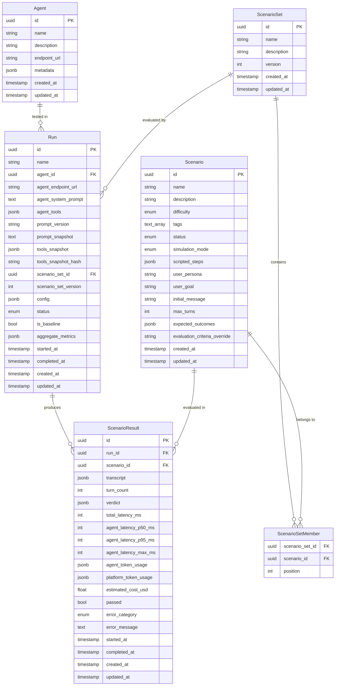

# Data Model — connexity-evals

## Entity Relationship Diagram

## Enums

| Enum | Values |
|------|--------|
| `Difficulty` | `normal`, `hard` |
| `ScenarioStatus` | `draft`, `active`, `archived` |
| `SimulationMode` | `scripted`, `llm_driven` |
| `RunStatus` | `pending`, `running`, `completed`, `failed`, `cancelled` |
| `ErrorCategory` | `none`, `off_topic`, `hallucination`, `refusal`, `tool_misuse`, `safety_violation`, `prompt_violation`, `incomplete`, `latency_timeout`, `agent_error`, `other` |
| `TurnRole` | `user`, `agent`, `system` |

## JSONB Nested Entities

These are stored inside JSONB columns, not as separate tables.

### RunConfig (stored in `runs.config`)

| Field | Type | Default |
|-------|------|---------|
| `judge_model` | `str \| None` | `None` |
| `judge_provider` | `str \| None` | `None` |
| `simulator_model` | `str \| None` | `None` |
| `simulator_provider` | `str \| None` | `None` |
| `concurrency` | `int` | `5` |
| `timeout_per_scenario_ms` | `int` | `120000` |
| `simulation_mode_override` | `SimulationMode \| None` | `None` |

### ConversationTurn (stored in `scenario_results.transcript`)

| Field | Type |
|-------|------|
| `index` | `int` |
| `role` | `TurnRole` |
| `content` | `str` |
| `tool_calls` | `list[ToolCall] \| None` |
| `latency_ms` | `int \| None` |
| `token_count` | `int \| None` |
| `timestamp` | `datetime` |

### ToolCall (nested in `ConversationTurn.tool_calls`)

| Field | Type |
|-------|------|
| `tool_name` | `str` |
| `tool_input` | `dict[str, Any]` |
| `tool_result` | `Any \| None` |

### JudgeVerdict (stored in `scenario_results.verdict`)

| Field | Type | Default |
|-------|------|---------|
| `passed` | `bool` | — |
| `overall_score` | `float` | — |
| `criterion_scores` | `list[CriterionScore]` | — |
| `error_category` | `ErrorCategory` | `none` |
| `summary` | `str` | — |
| `raw_judge_output` | `str \| None` | `None` |
| `judge_model` | `str` | — |
| `judge_provider` | `str` | — |
| `judge_latency_ms` | `int \| None` | `None` |
| `judge_token_usage` | `dict[str, int] \| None` | `None` |

### CriterionScore (nested in `JudgeVerdict.criterion_scores`)

| Field | Type | Default |
|-------|------|---------|
| `criterion` | `str` | — |
| `score` | `float` | — (1.0–5.0) |
| `label` | `str` | — (fail\|poor\|acceptable\|good\|excellent) |
| `weight` | `float` | `1.0` |
| `justification` | `str` | — |

### AggregateMetrics (stored in `runs.aggregate_metrics`)

| Field | Type | Default |
|-------|------|---------|
| `total_scenarios` | `int` | — |
| `passed_count` | `int` | — |
| `failed_count` | `int` | — |
| `error_count` | `int` | — |
| `pass_rate` | `float` | — |
| `latency_p50_ms` | `float \| None` | `None` |
| `latency_p95_ms` | `float \| None` | `None` |
| `latency_max_ms` | `float \| None` | `None` |
| `latency_avg_ms` | `float \| None` | `None` |
| `total_agent_token_usage` | `dict[str, int] \| None` | `None` |
| `total_platform_token_usage` | `dict[str, int] \| None` | `None` |
| `total_estimated_cost_usd` | `float \| None` | `None` |
| `error_category_distribution` | `list[ErrorCategoryCount]` | `[]` |
| `avg_overall_score` | `float \| None` | `None` |

### ScriptedStep (stored in `scenarios.scripted_steps`)

| Field | Type |
|-------|------|
| `user_message` | `str` |
| `expected_agent_behavior` | `str \| None` |
| `max_response_time_ms` | `int \| None` |

### ExpectedOutcome (stored in `scenarios.expected_outcomes`)

| Field | Type | Default |
|-------|------|---------|
| `criterion` | `str` | — |
| `weight` | `float` | `1.0` |
| `evaluation_hint` | `str \| None` | `None` |

## Indexes

| Table | Index | Type |
|-------|-------|------|
| `scenario` | `difficulty` | btree |
| `scenario` | `status` | btree |
| `scenario` | `tags` | GIN |
| `scenario_set` | `name` | btree |
| `scenario_set_member` | `scenario_set_id` | btree |
| `run` | `agent_id` | btree |
| `run` | `scenario_set_id` | btree |
| `run` | `status` | btree |
| `run` | `is_baseline` | btree |
| `run` | `created_at` | btree |
| `scenario_result` | `run_id` | btree |
| `scenario_result` | `scenario_id` | btree |
| `scenario_result` | `passed` | btree |
| `scenario_result` | `error_category` | btree |

## Critical Design Decision

`agent_system_prompt`, `agent_tools`, and `tools_snapshot` live on the **Run** entity (captured at eval time), **NOT** on Scenario. This ensures that each evaluation run captures a complete snapshot of the agent configuration at that point in time.
