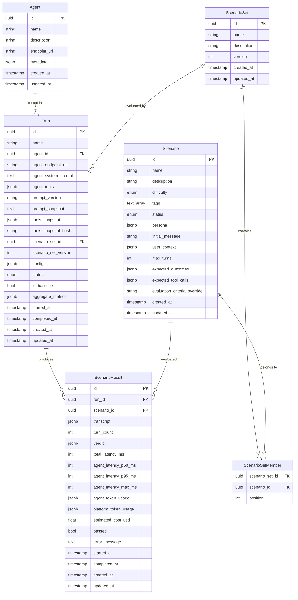

# Data Model — connexity-evals

## Entity Relationship Diagram

## Enums

| Enum | Values |
|------|--------|
| `Difficulty` | `normal`, `hard` |
| `ScenarioStatus` | `draft`, `active`, `archived` |
| `RunStatus` | `pending`, `running`, `completed`, `failed`, `cancelled` |
| `TurnRole` | `user`, `assistant`, `system`, `tool` |

## JSONB Nested Entities

These are stored inside JSONB columns, not as separate tables.

### RunConfig (stored in `runs.config`)

| Field | Type | Default |
|-------|------|---------|
| `concurrency` | `int` | `5` |
| `timeout_per_scenario_ms` | `int` | `120000` |
| `judge` | `JudgeConfig \| None` | `None` |
| `simulator` | `SimulatorConfig \| None` | `None` |

### JudgeConfig (nested in `RunConfig.judge`)

| Field | Type | Default |
|-------|------|---------|
| `metrics` | `list[MetricSelection] \| None` | `None` |
| `pass_threshold` | `float` | `75.0` |
| `model` | `str \| None` | `None` |
| `provider` | `str \| None` | `None` |

### SimulatorConfig (nested in `RunConfig.simulator`)

| Field | Type | Default |
|-------|------|---------|
| `mode` | `SimulatorMode` | `llm` |
| `scripted_messages` | `list[str]` | `[]` |
| `model` | `str \| None` | `None` |
| `provider` | `str \| None` | `None` |
| `temperature` | `float \| None` | `None` |

### ConversationTurn (stored in `scenario_results.transcript`)

| Field | Type |
|-------|------|
| `index` | `int` |
| `role` | `TurnRole` |
| `content` | `str \| None` |
| `tool_calls` | `list[ToolCall] \| None` |
| `tool_call_id` | `str \| None` |
| `latency_ms` | `int \| None` |
| `token_count` | `int \| None` |
| `timestamp` | `datetime` |

### ToolCall (nested in `ConversationTurn.tool_calls`)

OpenAI chat-completions shape, plus optional `tool_result` for platform-stored outcomes.

| Field | Type |
|-------|------|
| `id` | `str` |
| `type` | `function` |
| `function` | `ToolCallFunction` (`name`, `arguments` JSON string) |
| `tool_result` | `Any \| None` |

### JudgeVerdict (stored in `scenario_results.verdict`)

| Field | Type | Default |
|-------|------|---------|
| `passed` | `bool` | — |
| `overall_score` | `float` | — |
| `metric_scores` | `list[MetricScore]` | — |
| `summary` | `str \| None` | `None` |
| `raw_judge_output` | `str \| None` | `None` |
| `judge_model` | `str` | — |
| `judge_provider` | `str` | — |
| `judge_latency_ms` | `int \| None` | `None` |
| `judge_token_usage` | `dict[str, int] \| None` | `None` |

### MetricScore (nested in `JudgeVerdict.metric_scores`)

| Field | Type | Default |
|-------|------|---------|
| `metric` | `str` | — |
| `score` | `int` | — (0–5 scored; 0 or 5 binary) |
| `label` | `str` | — (critical_fail\|fail\|poor\|acceptable\|good\|excellent / pass\|fail) |
| `weight` | `float` | `1.0` |
| `justification` | `str` | — |
| `is_binary` | `bool` | `false` |
| `tier` | `str \| None` | `None` |
| `failure_code` | `str \| None` | `None` — judge-generated label when metric scored poorly |
| `turns` | `list[int]` | `[]` — turn indices where the issue was observed |

### AggregateMetrics (stored in `runs.aggregate_metrics`)

| Field | Type | Default |
|-------|------|---------|
| `total_scenarios` | `int` | — |
| `passed_count` | `int` | — |
| `failed_count` | `int` | — |
| `error_count` | `int` | — |
| `pass_rate` | `float` | — |
| `latency_p50_ms` | `float \| None` | `None` |
| `latency_p95_ms` | `float \| None` | `None` |
| `latency_max_ms` | `float \| None` | `None` |
| `latency_avg_ms` | `float \| None` | `None` |
| `total_agent_token_usage` | `dict[str, int] \| None` | `None` |
| `total_platform_token_usage` | `dict[str, int] \| None` | `None` |
| `total_estimated_cost_usd` | `float \| None` | `None` |
| `avg_overall_score` | `float \| None` | `None` |

### Persona (stored in `scenarios.persona`)

| Field | Type |
|-------|------|
| `type` | `str` |
| `description` | `str` |
| `instructions` | `str` |

### ExpectedToolCall (stored in `scenarios.expected_tool_calls`)

| Field | Type | Default |
|-------|------|---------|
| `tool` | `str` | — |
| `expected_params` | `dict[str, Any] \| None` | `None` |

### expected_outcomes (stored in `scenarios.expected_outcomes`)

Free-form `dict[str, Any]`. Keys are descriptive labels (e.g. `"refund_initiated"`), values are expected state (bool, string, etc.). The judge interprets these semantically.

## Indexes

| Table | Index | Type |
|-------|-------|------|
| `scenario` | `difficulty` | btree |
| `scenario` | `status` | btree |
| `scenario` | `tags` | GIN |
| `scenario_set` | `name` | btree |
| `scenario_set_member` | `scenario_set_id` | btree |
| `run` | `agent_id` | btree |
| `run` | `scenario_set_id` | btree |
| `run` | `status` | btree |
| `run` | `is_baseline` | btree |
| `run` | `created_at` | btree |
| `scenario_result` | `run_id` | btree |
| `scenario_result` | `scenario_id` | btree |
| `scenario_result` | `passed` | btree |

## Critical Design Decision

`agent_system_prompt`, `agent_tools`, and `tools_snapshot` live on the **Run** entity (captured at eval time), **NOT** on Scenario. This ensures that each evaluation run captures a complete snapshot of the agent configuration at that point in time.
